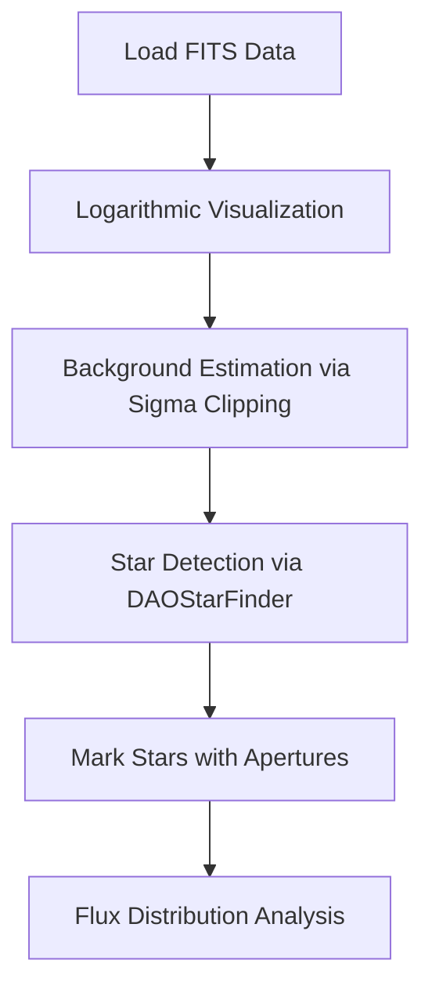

# Messier 12 Globular Cluster Analysis: Astrophysical Workflow

This project provides a comprehensive, beginner-friendly pipeline for analyzing the **Messier 12 (M12)** globular cluster using real astronomical data from the **Hubble Space Telescope (HST)**. By leveraging standard Python libraries, it demonstrates how to transform raw scientific data into meaningful stellar catalogs and visualizations.

---

##  Project Overview
The analysis focuses on extracting information from **FITS** (Flexible Image Transport System) files, the gold standard for astronomical data. The workflow moves from raw pixel data to statistical background estimation, automated star detection, and stellar brightness (flux) analysis.

###  Tech Stack
| Category | Tools/Libraries |
| :--- | :--- |
| **Language** | `Python` |
| **Data Handling** | `NumPy`, `Pandas`, `Astropy` |
| **Astrophysics** | `Photutils`, `Astropy.stats` |
| **Visualization** | `Matplotlib` |


## The Astrophysical Workflow
To understand the process of turning an image into data, follow this step-by-step logic:




## 1. Understanding & Visualizing FITS Data
**FITS** files are more than just images; they are containers for scientific metadata, telescope observations, and multi-dimensional arrays.

### Logarithmic Scaling: The "Squint" Intuition
Astronomical images have an **extreme dynamic range**. A bright star might be thousands of times brighter than a faint one. If visualized linearly, the bright stars "blow out" the image, making everything else look black.

*   **The Solution:** Use `LogNorm()` from `matplotlib.colors`.
*   **Why?** It "compresses" the brightness scale, revealing hidden cluster structures, faint stars, and background variations.

```python
from astropy.io import fits
from matplotlib.colors import LogNorm

# Loading the data
with fits.open("messier12.fits") as hdul:
    data = hdul.data

# Visualizing with log scaling
plt.imshow(data, cmap='inferno', origin='lower', norm=LogNorm())
```


## 2. Background Estimation (Sigma Clipping)
Before detecting stars, we must define what "empty space" looks like. Raw images contain **detector noise**, **sky glow**, and **cosmic rays**.

### The Concept: $\mu \pm n\sigma$
**Sigma Clipping** is an iterative process that calculates the mean ($\mu$) and standard deviation ($\sigma$) of the image, then throws away pixels that are too far from the average (outliers).
*   **Intuition:** Imagine trying to find the average height of grass in a field that has several tall trees. If you include the trees, your "average height" is wrong. Sigma clipping ignores the "trees" (stars) to find the true level of the "grass" (background).

> **Key Formula:** Outliers are removed if they fall outside the range of $\mu \pm n\sigma$, where $n$ is the clipping threshold (usually 3.0).


## 3. Automated Star Detection (DAOStarFinder)
To identify stars, we use the `DAOStarFinder` algorithm, which searches for **bright peaks** that match a specific **star-like shape**.

### Critical Parameters
1.  **FWHM (Full Width at Half Maximum):** Defines the "fatness" of a typical star in pixels.
2.  **Threshold:** The brightness level above the background required to be considered a star (e.g., $5 \times \sigma$).

```python
from photutils.detection import DAOStarFinder

# Identify objects significantly brighter than the background
daofind = DAOStarFinder(fwhm=3.0, threshold=5.0 * std)
sources = daofind(data - median)
```


## 4. Stellar Flux Analysis
**Flux** represents the total brightness of a star. In a globular cluster like M12, the distribution is heavily skewed.

*   **The Observation:** Most stars are relatively dim (low flux), while only a few giants are extremely bright.
*   **The Visualization:** To see this relationship clearly, we transform flux into a **logarithmic scale** (`np.log10(fluxes)`) before plotting a histogram.


## Summary Table
| Step | Technique | Goal |
| :--- | :--- | :--- |
| **Loading** | `fits.open` | Access raw scientific arrays and metadata. |
| **Scaling** | `LogNorm` | Reveal faint details hidden by high-contrast stars. |
| **Cleaning** | `Sigma Clipping` | Isolate background noise from stellar signals. |
| **Detection** | `DAOStarFinder` | Extract X/Y coordinates of star-like objects. |
| **Validation** | `CircularAperture` | Visually verify detection by marking star centers. |
